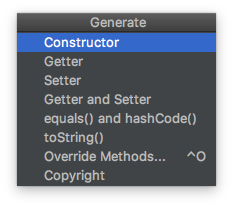
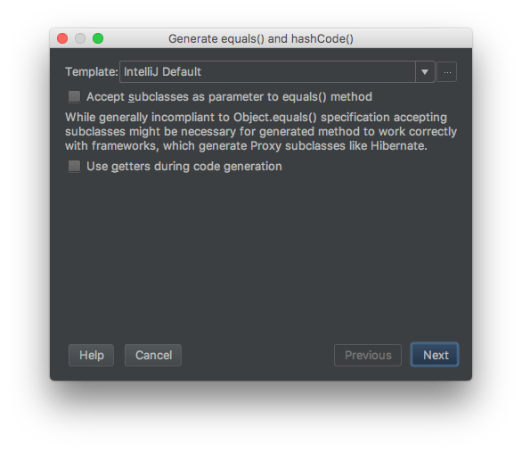
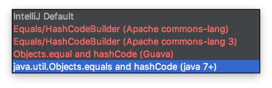

= 3장 모든 객체의 공통 메서드
Gnob <gnob244@gmail.com>

== 개요
자바에선 모든 객체들이 `Object`를 확장한다. Object에는 다음과 같은 non-`final` 메서드들이 있다.

* equals
* hashCode
* toString
* clone
* finalize

이 메서드들은 명시적인 *일반 규약*(general contract)를 가지고 있다.
또한 이 메서드들은 `override`해서 사용하도록 설계되어있다.
만약 메서드를 `override` 하는데 규약을 따르지 않으면 HashMap 같은 클래스와 함께 사용할 때 문제가 발생할 수 있다.
HashMap은 해당 규약에 의존하기 때문이다.
이번 장에서 이들을 언제, 어떻게 정의하면 좋을지 알아본다.

== [규칙 8] equals를 재정의할 때는 일반 규약을 따르라
=== 알아두기
이 규칙에서 주의깊게 생각해야할 건 `equals` 메서드의 역할이다.
`equals` 메서드는 주로 *논리적 동일성*을 비교하기 위해 사용된다.
이에 대해선 `equals` 일반 규약에서 찾아볼 수 있다.
(참고 - https://docs.oracle.com/javase/7/docs/api/java/lang/Object.html#equals(java.lang.Object)[Object 클래스 명세 중 equals 메소드 부분])

모든 클래스들의 근간이 되는 Object 클래스는 `equals` 메소드를 아래와 같이 구현한다.

[source,java]
----
public boolean equals(Object obj) {
  return (this == obj);
}
----

Object 클래스는 객체 동일성만을 비교하는데, 이는 Object 클래스 관점에선 각각의 객체가 고유하기 때문이다. (비교할만한 상태 값이 없다)
따라서 하위 클래스에서 Object의 `equals` 메소드를 그냥 사용하게 될 경우 부가적인 논리적 동일성에 대한 보장을 못받는다.
여기서 같이 알아두면 좋은 것은 == 연산자이다.
(참고 - http://docs.oracle.com/javase/specs/jls/se7/html/jls-15.html#jls-15.21.3[Reference Equality Operators == and !=])

=== 경우에 따라서는 equals 메서드를 재정의할 필요가 없다
`equals` 메서드를 재정의 할땐 실수의 여지가 많다.
아래와 같은 조건 중 하나만 만족되면 `equals` 메서드를 재정의하지 않는게 좋다.

* 각각의 객체가 고유하다 (자기 자신하고만 같다)
** 값(value) 대신 활성 개체(active entity)를 나타내는 경우
*** ex) Thread 클래스

* 클래스에 _논리적으로 동일한지_를 검사할 방법이 있어도 되고 없어도 경우
** 논리적으로 동일한지를 검사하는건 객체의 상태를 비교하는 것이므로 비교시 객체를 상세히 알고 있어야 한다.

* 상위 클래스에서 재정의한 `equals`가 하위 클래스에서 사용하기에 적당한 경우
** 대부분의 Collection 들은 이 경우에 해당한다.
** 예를들어 대부분의 List 클래스는 AbstractList의 `equals` 메서드를 그대로 사용한다.

* 클래스가 private 또는 package-private으로 선언되어 있고, `equals` 메서드를 호출할 일이 없는 경우
** 방어적 코딩 관점에선 실수로 호출할 경우에 대비해서 `equals`를 재정의 하는게 낫다.

[source,java]
----
@Override
public Boolean equals(Object o) {
  throw new AssertionError(); <1>
}
----
<1> 호출 되선 안되는 메서드를 호출했다는 뜻

==== package-private
아래와 같은 경우를 package-private, 혹은 default 라고 부른다. (참고 - http://docs.oracle.com/javase/specs/jls/se7/html/jls-6.html#jls-6.6.1[6.6.1. Determining Accessibility])

[source,java]
----
package points;

class PointVec {
  Point[] vec;
}
----

[source,java]
----
package points;

public class Point {
  protected int x, y;
  public void move(int dx, int dy) { x += dx; y += dy; }
  public int getX() { return x; }
  public int getY() { return y; }
}
----

위 두 클래스는 package-private으로 정의되어 있고, 같은 페키지이므로 서로 참조할 수 있다.

=== 논리적 동일성을 지원하는 클래스거나, 하위클래스에서 상위 클래스의 equals만으로는 부족할 때
이럴 경우 `equals` 메서드를 재정의하는 것이 바람직하다.
논리적 동일성을 지원한다는건 Integer, Date 같은 클래스를 예시가 있다.

[source,java]
----
@Test
public void testIntegerEquals() throws Exception {
  Integer foo = new Integer(1);
  Integer bar = new Integer(1);

  assertThat(foo == bar, is(false)); <1>
  assertThat(foo.equals(bar), is(true)); <2>
}
----
<1> Reference 주소에 대한 비교를 하므로 `false`. 동일한 객체가 아니다.
<2> Integer의 `equals` 구현은 일반 규약을 따른다. 논리적 동일성을 비교하므로 값을 비교하고, 결과는 `true`.

==== 부연설명
아래와 같이 Point 클래스를 정의했다고 해보자.

[source,java]
----
public class BadPoint {
  private int x, y;

  public BadPoint(int x, int y) {
    this.x = x;
    this.y = y;
  }

  public int getX() {
    return x;
  }

  public int getY() {
    return y;
  }

  <1>
}
----
<1> `equals` 메소드를 정의하지 않았다.

두 점이 같은지 비교하고 싶다면 두 점의 좌표가 같아야 할 것이다.
이런 논리적 동일성을 비교하기 위해선 *상위 클래스의 `equals` 메소드 만으로는 부족*하다.

[source,java]
----
@Test
public void shouldNotEqual() {
  final int x = 1;
  final int y = 2;

  BadPoint pointA = new BadPoint(x, y);
  BadPoint pointB = new BadPoint(x, y);

  assertThat(pointA == pointB, is(false)); <1>
  assertThat(pointA.equals(pointB), is(false)); <2>
  assertThat(pointA.getX() == pointB.getX() && pointA.getY() == pointB.getY(), is(true)); <3>
}
----
<1> Reference 주소에 대한 비교를 하므로 `false`. 동일한 객체가 아니다.
<2> BadPoint 클래스는 `equals` 구현하지 않았으므로 Object 클래스의 `equals`가 호출된다. Point 입장에서 논리적 동일성을 지원하지 않는다. 따라서 `false`
<3> 우리는 두 점의 좌표 값이 같아야 한다는걸 알기 때문에 각 좌표 값을 비교해서 논리적 동일성을 알아볼 수 있다. 이 경우 `true`

따라서 하위 클래스에서 `equals`를 아래와 같이 구현하면 된다.

[source,java]
----
public class Point {
  private int x, y;

  public Point(int x, int y) {
    this.x = x;
    this.y = y;
  }

  public int getX() {
    return x;
  }

  public int getY() {
    return y;
  }

	@Override
	public boolean equals(Object o) {
		if (this == o)
			return true;
		if (o == null || getClass() != o.getClass())
			return false;

		Point point = (Point) o;

		if (x != point.x)
			return false;
		return y == point.y;
	}

	@Override
	public int hashCode() {
		int result = x;
		result = 31 * result + y;
		return result;
	}
}
----

[source,java]
----
@Test
public void shouldEqual() {
  final int x = 1;
  final int y = 2;

  Point pointA = new Point(x, y);
  Point pointB = new Point(x, y);

  assertThat(pointA == pointB, is(false));
  assertThat(pointA.equals(pointB), is(true)); <1>
  // assertThat(pointA.getX() == pointB.getX() && pointA.getY() == pointB.getY(), is(true)); <2>
}
----
<1> 이제는 논리적 동일성을 보장하는 `equals`이므로 결과는 `true`
<2> 두 점의 동일성을 알기위해 좌표 값을 직접 비교할 필요가 없어졌다.

[%hardbreaks]
NOTE: 물론 `equals` 메소드를 구현하지 않고 주석이된 2번처럼 클라이언트가 직접 값을 비교할 수도 있다.
만약 Point가 2차원이 아닌 N차원 좌표계에 있다면 어떨까? 그 N을 클라이언트가 알 수 없다면?
즉 클라이언트가 객체에 대해 자세히 알지 않는 이상 논리적 동일성을 비교할 수 없게된다.

=== equals의 일반 규약 5가지
[quote, 'https://docs.oracle.com/javase/7/docs/api/java/lang/Object.html#equals(java.lang.Object)[Object 클래스 명세 중 equals 메소드 부분]']
____
[.lead]
The equals method implements an equivalence relation on non-null object references

. It is *reflexive*:
* for any non-null reference value x, x.equals(x) should return true.
. It is *symmetric*:
* for any non-null reference values x and y, x.equals(y) should return true if and only if y.equals(x) returns true.
. It is *transitive*:
* for any non-null reference values x, y, and z, if x.equals(y) returns true and y.equals(z) returns true, then x.equals(z) should return true.
. It is *consistent*:
* for any non-null reference values x and y, multiple invocations of x.equals(y) consistently return true or consistently return false, provided no information used in equals comparisons on the objects is modified.
. For any non-null reference value x, x.equals(null) should return false.
____

==== 반사성 (Reflexivity)
모든 객체는 자기 자신과 같아야 한다.

[source,java]
----
@Override
public boolean equals(Object o) {
  if (this == o)
    return true;
}
----

==== 대칭성 (Symmetry)
비교되는 두 객체에게 서로 물어봤을때 같은 답이 나와야한다.
어떤 클래스가 자신과 같은 클래스의 객체가 아닌 다른 객체와 비교를 할려는 경우 특히 주의해야한다.

[source,java]
----
public final class CaseInsensitiveString {
  private final String s;

  public CaseInsensitiveString(String s) {
    if (s == null)
      throw new NullPointerException();
    this.s = s;
  }

  @Override
  public boolean equals(Object o) {
    if (o instanceof CaseInsensitiveString)
      return s.equalsIgnoreCase(((CaseInsensitiveString) o).s);
    if (o instanceof String) <1>
      return s.equalsIgnoreCase((String) o);

    return false;
  }
}
----
<1> 대칭성 위반이다. String 클래스의 `equals` 메서드에서는 CaseInsensitiveString 클래스의 존재를 모르기 때문.

[source,java]
----
@Test
public void testSymmetry() {
  CaseInsensitiveString cis = new CaseInsensitiveString("Effective-breakfast");
  String s = "effective-breakfast";

  assertThat(cis.equals(s), is(true)); <1>
  assertThat(s.equals(cis), is(true)); <2>
}
----
<1> CaseInsensitiveString 클래스에서는 String 클래스에 대해 특별히 비교를 하므로 `true`
<2> String 클래스는 CaseInsensitiveString 클래스를 모르므로 우리가 기대하는 비교를 하지 않는다. `false`

이 경우 대칭성을 어기지 않으려면 사실상 자신의 클래스와 같은 클래스의 객체만 비교해야하므로 `equals` 메서드를 다음과 같이 수정해야한다.

[source,java]
----
@Override
public boolean equals(Object o) {
  if (o instanceof CaseInsensitiveString)
    return s.equalsIgnoreCase(((CaseInsensitiveString) o).s);
  else
    return false;
}
----

==== 추이성 (Transitivity)
[.lead]
객체 A, B, C가 있다고 가정할때

 A.equals(B)가 true이고
 C.equals(B)가 true 이면
 A.equals(C)가 true 여야 한다.

위와 같은 조건을 만족하는 것을 추이성이라고 한다.
문제는 다음과 같은 경우 추이성은 깨질 수 밖에 없다

* 객체 생성 가능(instantiable) 클래스를 계승(extend)해 새로운 값 컴포넌트를 추가할 때

이 문제의 핵심은 #객체 생성 가능 클래스를 계승을 할 때 하위 클래스와 상위 클래스 사이에서 *다형성의 혜택*을 누리면서 *`equals` 메서드의 대칭성을 보존*하고 동시에 *추이성을 보존*할 수 없다는 것#이다.
(이에 대한 예시는 책을 참고하라)
즉, 위 경우에는 객체 지향적 추상화의 혜택(다형성)을 포기하지 않는한 일반 규약을 지키는 `equals` 메소드를 작성할 수 없다.
설사 그렇게 포기해서 `getClass()`를 이용해 구현할지라도 결국 SOLID 원칙 중 리스코프 대체 원칙이 깨지므로 올바른 동작하는 클래스를 작성할 수 없게된다.

따라서 책에선 문제를 해결하기 보단 피하는걸 권장하는데 그 방법이 `[규칙 16] 계승하는 대신 구성(composition)하라`이다.
상위 클래스를 계승하는 대신에 private 필드로 품어서 컴포넌트화 하는 것이다.
이 방법 역시 다형성을 누릴 수는 없지만 public 뷰(view) 메서드를 만들면 어느정도 타협을 할 수 있다.

또다른 방법은 상위 클래스를 abstract로 선언해 객체 생성이 불가능하도록 하면 된다.

==== 일관성 (Consistency)
같다고 판정된 객체들은 추후 상태가 변경되지 않는 한 계속 같아야 한다.
변경 가능한 객체(mutable object)는 같은 객체는 항상 같게, 다른 객체는 항상 다르게 판정되도록 주의를 기울여야한다.
또한 어떤 객체든 `equals` 메소드를 구현할 때 신뢰성이 보장되지 않는 자원을 이용해 비교하지 말아야 한다.
그런 결과를 예측하기 힘든 자원을 이용하기 보단 가급적 메모리에 존재하는 객체들만 사용해 결정적(deterministic) 계산으로 비교되어야 한다.

==== 널(Null)에 대한 비 동치성
모든 객체는 null과 동일하지 않다.
당연하게도 null과 같은 객체는 없지만, 이에 대한 검사를 하지 않으면 NullPointerException이 발생할 수 있다.
`equals` 메소드의 일반 규약은 입력값 null에 대해 false 값을 기대하지 예외를 기대하지 않는다.
따라서 입력 인자에 대해 null 검사를 할 필요가 있다.

[source,java]
----
@Override
public boolean equals(Object o) {
  if (this == o)
    return true;
  if (getClass() == o.getClass())  <1>
    return true;

  return false;
}
----
<1> 입력 인자 `o`에 대해 null 검사를 하지 않으므로 NullPointerException의 우려가 있음

보통 `equals` 메소드에선 입력 인자에 대한 형변환이 이루어지고 이에 대한 검사 수단으로 `instanceof`를 이용한다.
`instanceof` 는 null에 대해서도 false를 반환하므로 아래 코드는 null에 대해 안전한 코드이다.

[source,java]
----
@Override
public boolean equals(Object o) {
  if (this == o)
    return true;
  if ( !(o instanceof Point) ) <1>
    return false;

  Point point = (Point) o;
  return x == point.x && y == point.y;
}
----
<1> `instanceof`가 null에 대한 방어도 해줌

=== 훌륭한 equals 메서드 구현하기
. == 연산자를 사용해서 자기 자신인지를 검사하라
* 동치성을 위한 것뿐만 아니라 자기 자신에 대한 불피요한 검사를 피하게 된다. (성능 최적화)
. `instanceof` 연산자를 사용하여 자료형이 정확한지 검사하고 형변환 하라
* 실패하지 않는 형변환을 할 수 있다.
. 중요 필드 각각이 인자로 주어진 객체의 해당 필드와 일치하는지 검사하라
* float나 double은 각각 `Float.compare()`, `Double.compare()`를 사용해 검사한다.
** 이 두 자료형은 특별한 상수가 있기 때문이다. (Float.NaN, -0.0f 등)
* 배열은 `Arrays.equals()`를 통해 모든 요소에 대해 비교할 수 있다.
* 객체를 참조 필드는 null 검사를 반드시 해라.
* 필드를 비교하는 순서를 고려해라.
** 다를 가능성이 높은 필드부터 비교하면 성능을 올릴 수 있다.
. `equals` 메서드의 구현이 끝났다면 대칭성, 추이성, 일관성의 세 속성이 만족되는 테스트 코드를 작성해라
. [규칙 8] `equals` 메서드를 구현할 때는 `hashCode` 메서드도 재정의하라
. 너무 복잡하게 고려하지 마라
* 필드들만 보고 동치성을 검사하는 편이 더 깊은 고민을 하는 것보다 나을 수 있다.
. `equals` 메서드의 인자 형을 Object에서 다른 것으로 바꾸지 마라
* 인자의 자료형을 바꾸는 순간 `override`가 아닌 `overload`가 된다.
* 상위 클래스의 `equals` 메서드를 재정의 하는 것이 아니기 때문에 버그를 유발하는 코드를 작성할 수도 있다.
* 이와 같은 실수를 피하기 위해 `@Override` 어노테이션을 사용하라.
** 이 어노테이션을 사용하고 재정의하지 않았다면 컴파일 타임에 오류가 발생한다.

=== IDE에서 지원하는 equals 메서드 자동 생성
==== IntelliJ
macOS를 기준으로, IntelliJ에서 `⌘(CMD) + N`을 누르면 아래와 같은 메뉴가 나온다.

클래스에 대해 필요한 것들을 자동으로 만들어주는 `Generate` 메뉴로, 그 중에는 `equals`도 있다.
`equals() and hashCode()`를 눌러보자

해당 구문들을 생성할 때 추가적인 옵션을 줄 수 있다.

* `Accept subclasses as parameter to equals() method`
** `equals`는 parameter로 Object 클래스를 받지만, 하위 클래스로 받도록 재정의 할 수도 있다.
** Type을 컴파일 타임에 강제할 수 있지만 책에서 언급된 것 처럼 복잡도 대비 효용엔 의문

Template은 다음과 같이 있다.

===== IntelliJ Default
Template을 `IntelliJ Default`로 지정하면 아래와 같이 코드가 생성된다.

[source,java]
----
public class Point {
  private int x, y;

  public Point(int x, int y) {
    this.x = x;
    this.y = y;
  }

  @Override
  public boolean equals(Object o) {
    if (this == o) <1>
      return true;
    if (o == null || getClass() != o.getClass()) <2>
      return false;

    Point point = (Point) o; <3>

    if (x != point.x) <4>
      return false;
    return y == point.y;
  }

  @Override
  public int hashCode() {
    int result = x;
    result = 31 * result + y;
    return result;
  }
}
----
<1> 반사성(reflexive)를 구현. 객체로써 자기 자신과 같은지 확인한다.
<2> 참조가 `null`인지 확인하고, 같은 클래스인지를 확인한다. 이 부분엔 논쟁의 여지가 있다.
<3> 위에서 같은 클래스인지를 확인했기 때문에, 캐스팅은 반드시 성공한다.
<4> 논리적 동일성을 비교한다.

===== java.util.Objects.equals and hashCode (java 7+)
`java.util.Objects.equals and hashCode (java 7+)`로 지정하면 다음과 같다.

[source,java]
----
public class Point {
  private int x, y;

  public Point(int x, int y) {
    this.x = x;
    this.y = y;
  }

  @Override
  public boolean equals(Object o) {
    if (this == o)
      return true;
    if (o == null || getClass() != o.getClass())
      return false;
    Point point = (Point) o;
    return x == point.x && y == point.y; <1>
  }

  @Override
  public int hashCode() {
    return Objects.hash(x, y);
  }
}
----
<1> `equals` 메소드는 사실상 IntelliJ Template과 같다.
